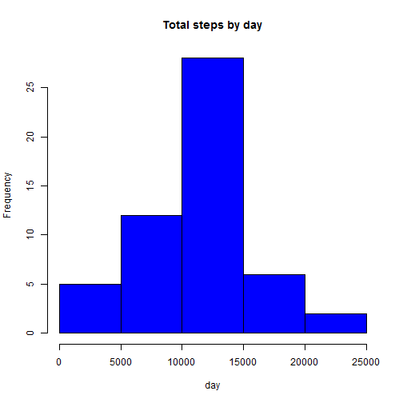
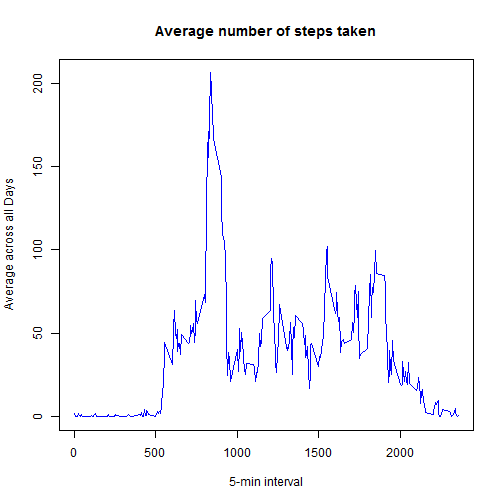
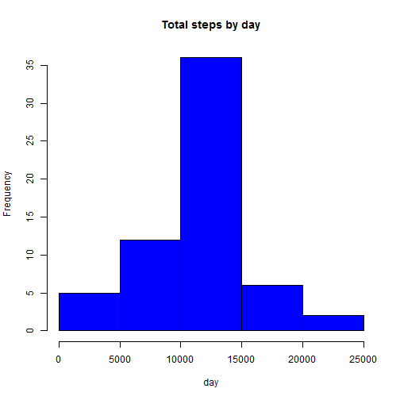
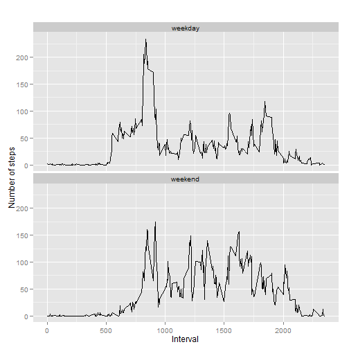

Reproducible Research: Peer Assessment 1
==========================================================

## Loading and preprocessing the data


```r
activity <- read.csv("activity.csv", colClasses = c("numeric", "character", "numeric"))
head(activity)
```

```
##   steps       date interval
## 1    NA 2012-10-01        0
## 2    NA 2012-10-01        5
## 3    NA 2012-10-01       10
## 4    NA 2012-10-01       15
## 5    NA 2012-10-01       20
## 6    NA 2012-10-01       25
```


Change the variable date (a factor variable) to a 'Date' variable

```r
activity$date <- as.Date(activity$date, "%Y-%m-%d")
```

## What is mean total number of steps taken per day?

Create a variable that contain total steps and plot a histogram

```r
TotalSteps <- aggregate(steps ~ date, data = activity, sum, na.rm = TRUE)
hist(TotalSteps$steps, main = "Total steps by day", xlab = "day", col="blue")
```

 

Show mean and median of of total steps taker per day

```r
mean(TotalSteps$steps)
```

```
## [1] 10766.19
```

```r
median(TotalSteps$steps)
```

```
## [1] 10765
```

## What is the average daily activity pattern?

Create a variable that takes average steps per day and plot a time series graph

```r
AverageSteps <- tapply(activity$steps, activity$interval, mean, na.rm = TRUE)

plot(row.names(AverageSteps), AverageSteps, type = "l", xlab = "5-min interval", 
     ylab = "Average across all Days", main = "Average number of steps taken",
     col = "blue")
```

 

Find the maximum steps taken into one day

```r
MaximumSteps <- which.max(AverageSteps)
names(MaximumSteps)
```

```
## [1] "835"
```

## Imputing missing values

Fill the missing values with the mean of steps taken that day


```r
MissingValues <- sum(is.na(activity))
MissingValues
```

```
## [1] 2304
```

```r
FillMissingValues <- aggregate(steps ~ interval, data = activity, FUN = mean)
fillNA <- numeric()
for (i in 1:nrow(activity)) {
  obs <- activity[i, ]
  if (is.na(obs$steps)) {
    steps <- subset(FillMissingValues, interval == obs$interval)$steps
  } else {
    steps <- obs$steps
  }
  fillNA <- c(fillNA, steps)
}

DatanoMissings <- activity
DatanoMissings$steps <- fillNA
```

Plot a histogram of the total number of steps taken each day and report the mean and median total number of steps taken per day


```r
TotalSteps2 <- aggregate(steps ~ date, data = DatanoMissings, sum, na.rm = TRUE)
hist(TotalSteps2$steps, main = "Total steps by day", xlab = "day", col = "blue")
```

 

```r
mean(TotalSteps2$steps)
```

```
## [1] 10766.19
```

```r
median(TotalSteps2$steps)
```

```
## [1] 10766.19
```

## Are there differences in activity patterns between weekdays and weekends?

Add new variables to the dataset 'activity', indicating the day of that measure and if it was a weekday or a weekend


```r
activity$Day <- weekdays(activity$date)
activity$DayType <- c("weekday")

for (i in 1:nrow(activity)){
  if (activity$Day[i] == "sábado" || activity$Day[i] == "domingo"){
    activity$DayType[i] <- "weekend"
  }
}

activity$DayType <- as.factor(activity$DayType)
```

Plot the average of steps taken in weekdays and weekends


```r
IntervalSteps <- aggregate(steps ~ interval+DayType, activity, mean)

library(ggplot2)
```

```
## Warning: package 'ggplot2' was built under R version 3.0.3
```

```r
qplot(interval, steps, data=IntervalSteps, geom=c("line"), xlab="Interval", 
      ylab="Number of steps", main="") + facet_wrap(~ DayType, ncol=1)
```

 
